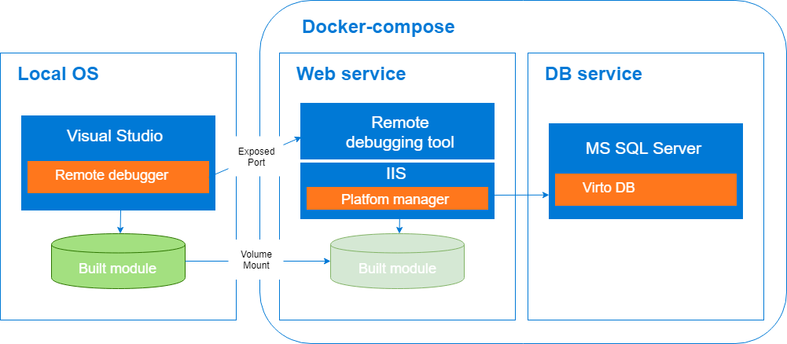
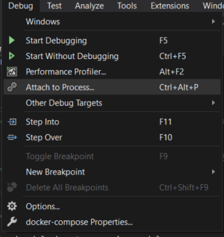
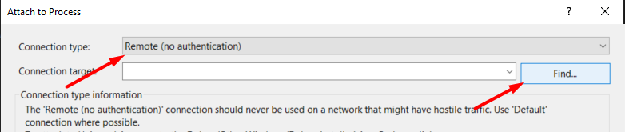
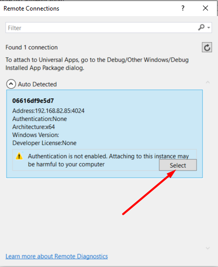
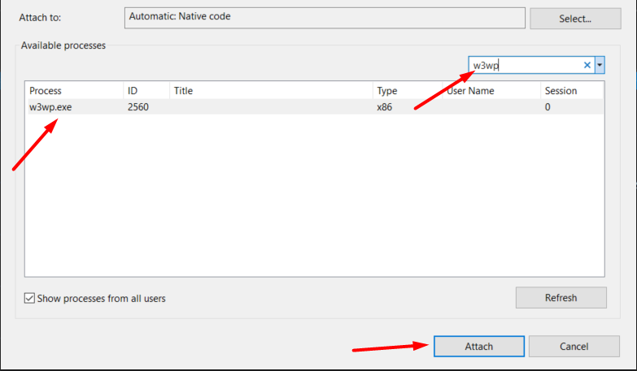

# Developing inside a Container

## Overview

The main idea is to simplify the initial setup process for development environment. This will speed up the onboarding process for new engineers who join to our team.
Developers would only need to download Docker and IDE (VIsual Studio), and not have to install external tools and services (IIS, SQL Server, VC platform manager). Code edits will be done from the IDE as per normal and the changes will be tracked and propagated from host to the container.

VC platform manager web app containerized as 2 services: 1 for web service and 1 for database. It runs as a multi-container app and orchestrate it using Docker Compose.

Web service container based on virtocommerce/platform latest image. Additionally Web service docker file contains code for download and install VirtoCommerce modules and [Visual Studio Remote Tool](https://visualstudio.microsoft.com/downloads#remote-tools-for-visual-studio-2019) to enabling the debug of a .Net Framework app.

When the Web service container is started, then the VC Platform manager and msvsmon.exe is executed on the container as well, because msvsmon.exe and IIS is defined as an entrypoint. Msvsmon.exe is interacting with Visual Studio and therefore we are able to set a breakpoint and debug the code as developer wish.

Developer write and build code for a new module in Visual Studio locally on host machine. To ensure that any code edits on host machine are automatically propagated to the container, folder with builded module on host machine is mapped to c:\vc-platform\modules folder in the container. This is only possible through bind mounting, which works similar to a *mklink* mount in Windows. When a path in the host mounted to a path in the container, the contents of the host directory will completely overwrite whatever is in the container directory, regardless of whether the container directory has files which were not present in the host directory at mount time. The result is that the container directory will be an exact snapshot of the host directory. This makes the development experience feel more natural.

## Prerequisites

* You need to have some basic understanding of [Docker](https://docs.docker.com/get-started/), [Docker Compose](https://docs.docker.com/compose/gettingstarted/), and the key terms used in the ecosystem.
* Install [Docker desktop for Windows](https://docs.docker.com/docker-for-windows/install/) on your machine. During installation you'll need to chose Windows as operating system used inside your containers.

## How to use

1. Fork repository
1. Clone repository to local machine
1. Open solution in Visual Studio
1. Write code for new module.
1. Build solution

Current solution based on [template](https://marketplace.visualstudio.com/items?itemName=Virto-Commerce.VirtoCommerceModuleTemplates) for a new Virto Commerce module creation. To template solution added support for Docker Compose to a Visual Studio 2019 project, it adds the following elements in the solution:

* New Visual Studio Project named “docker-compose” with the following files:
  * docker-compose.yml
  * docker-compose.override.yml
  * docker-compose.vs.debug.yml
  * Dockerfile
  * .dockerignore

When you open solution [Visual Studio tools for Docker](https://docs.microsoft.com/en-us/visualstudio/containers/overview?view=vs-2019) automatically build and up docker-compose.
First start can take long time for downloading base images (microsoft/mssql-server-windows-express, mcr.microsoft.com/dotnet/framework/aspnet,virtocommerce/platform) and building image from docker file.

[Visual Studio tools for Docker](https://docs.microsoft.com/en-us/visualstudio/containers/overview?view=vs-2019) monitor changes in docker-compose.yml, docker-compose.override.yml, docker-compose.vs.debug.yml, Dockerfile and rebuild docker images automatically.

## How to debug module

* Before debugging new module run VirtoCommerce platform manager in your browser: http:\\localhost
* Within Visual Studio, select the Attach to Process action in the Debug window:

* Chose **Connection type** **Remote** i in opened window and press the **Find** button to find the remote connection:

* The screenshot below shows the detected containers:

* Select container and press **Select** button.

* Once the container has been selected, then the running process can be selected.
For debugging a IIS web application select w3wp.exe process:

You can read more about remote debugging in Visual Studio in this [article](https://docs.microsoft.com/en-us/visualstudio/debugger/attach-to-running-processes-with-the-visual-studio-debugger?view=vs-2019).

## License

Copyright (c) Virto Solutions LTD.  All rights reserved.

Licensed under the Virto Commerce Open Software License (the "License"); you
may not use this file except in compliance with the License. You may
obtain a copy of the License at

<http://virtocommerce.com/opensourcelicense>

Unless required by applicable law or agreed to in writing, software
distributed under the License is distributed on an "AS IS" BASIS,
WITHOUT WARRANTIES OR CONDITIONS OF ANY KIND, either express or
implied.
